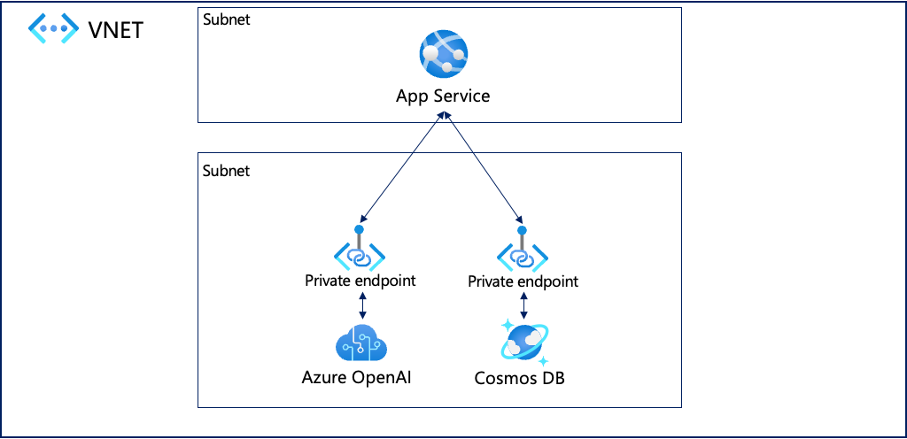

# 概要

Azure App Serviceを使って、NextjsアプリケーションでAzure OpenAIを扱うサンプルです。
各リソースはプライベートエンドポイントでの接続を可能とします。

## 構成



## 使い方

### Azureリソースの作成

azdを使ってリソースを準備します。

azdのログイン:

```bash
azd auth login
```

インフラの作成:

```bash
azd provision
```

リソースの削除:

```bash
azd down
```

### プライベートエンドポイントを利用する場合

```bash
azd env set AZURE_USE_PRIVATE_ENDPOINT true
```

さらに、Azure OpenAIとCosmosDBのパブリックアクセスを無効する場合

```bash
azd env set AZURE_PUBLIC_NETWORK_ACCESS Disabled
```

もしくは`.azure/{環境名}/.env`に以下のように記述します。

```bash
AZURE_USE_PRIVATE_ENDPOINT="true"
AZURE_PUBLIC_NETWORK_ACCESS="Disabled"
```

その上で`azd provision`を実行します。

### ローカルでの開発

`src/nextapp/.env.local`にAzureのリソース情報を設定します。  
`src/nextapp/.env.example`を参考にしてください。

例:

```bash
# Azure OpenAI Resource Name
AZURE_OPENAI_RESOURCE_NAME=my-openai-resource 
# ex. my-openai-resource **.openai.azure.comの**の部分
# Azure OpenAI API Key
AZURE_OPENAI_API_KEY=f3699df8b6f345289cc5cb8c93740d1f
# Cosmos DB Endpoint
COSMOS_DB_ENDPOINT=https://**.documents.azure.com:443/
# Cosmos DB Key
COSMOS_DB_KEY=fq2XN4ZhXL6UVS54AY05wqzMEOR6XBBTVPh27okEfFvNxqL4FmgIXJOewDxZp96ogWIpg4QDQMVKACDbJiRQng==
```

実行:

```bash
npm run dev
```

## 参照

[AI SDK, Next.js, and OpenAI Chat Example](https://github.com/vercel/ai/tree/main/examples/next-openai)